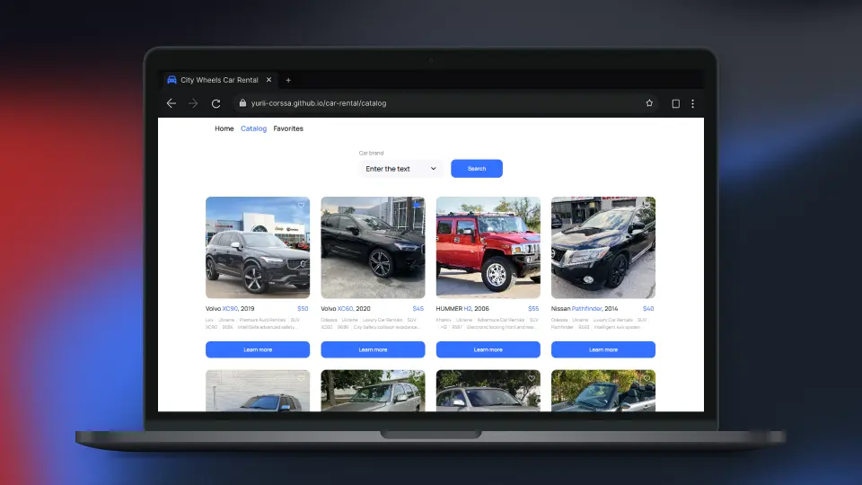

# City Wheels Car Rental

> Welcome to City Wheels Car Rental. This is web app that helps users quickly find the right vehicle: browse a curated catalog, filter by brand, and view detailed rental conditions in a clean modal. Favorites let you save options for later.



## Description

**City Wheels Car Rental** is an exam project built to demonstrate the frontend skills I acquired during study, executed under real‑like technical specs and a fixed deadline. The app follows a component‑driven React approach with lazy‑loaded routes, Redux Toolkit for predictable state, redux‑persist for favorites, and styled‑components for cohesive theming. Users browse a car catalog, filter by brand, progressively load more results, open detailed modals with accessories and rental conditions, and manage a Favorites list that survives reloads. Data comes from a MockAPI backend via axios; queries compose brand filters and a growing limit to keep interactions snappy without complex paging. UX focuses on usability and accessibility with keyboard‑dismissible modals/dropdowns, lazy images, and clear navigation. The result is a responsive, maintainable, and performant portfolio piece that showcases clean data‑fetching patterns and disciplined UI state.

## Key Features

- **Catalog and Filtering** - Server-driven queries with brand filter, item count retrieval, and incremental “Load more” pagination for smooth browsing.
- **Favorites Persistence** - Toggle favorites with cross‑session storage and a dedicated view.
- **Robust Data Fetching** - Centralized async calls, base URL, error handling; client‑side brand deduplication.
- **Route Architecture** - Lazy pages in a shared layout with a safe fallback route.

## Technology Stack

### **Frontend Technologies**

- **React** - component‑based UI
- **React Router** - client‑side routing
- **Redux** - predictable state container
- **Redux Toolkit** - streamlined state logic
- **Redux Persist** - state persistence across sessions
- **Redux Thunk** - async actions middleware
- **Axios** - HTTP client for API requests
- **Styled Components** - CSS‑in‑JS styling
- **nanoid** - lightweight unique IDs
- **Web Vitals** - performance metrics reporting

### **Build Tools**

- **Create React App** - build/dev tooling
- **ESLint** - code linting

## Getting Started

To run this project locally, you need to have `node` and `npm` installed.

1. Clone the repository:

   ```bash
   git clone https://github.com/yurii-corssa/car-rental.git
   cd car-rental
   ```

2. Install the dependencies:

   ```bash
   npm install
   ```

3. Run the project:

   ```bash
   npm start
   ```

## Contributing

Contributions are welcome! Feel free to create a pull request to suggest improvements or new features.

## License

This project is open source and available under the [MIT License](LICENSE).
